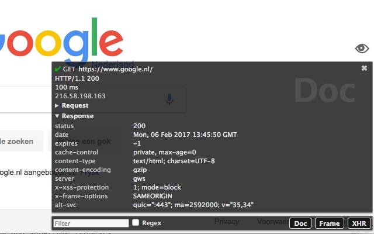
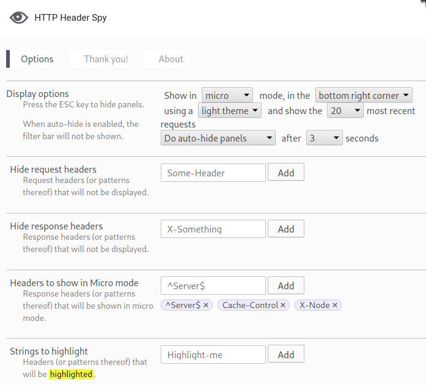

# HTTP Header Spy Webextension
HTTP Header Spy enables you to inspect request- response headers and cookies right after page load with no extra clicks.

Inspect HTTP headers and response times without opening the page inspector tool. View headers right in the page you are looking at.

- Auto-hide information panels after specified time
- Response times
- Server IP
- XHR and sub-frame requests
- Headers also available in the browser action popup
- Follow the full redirect path
- Show HSTS requests
- Colorful status indication icons
- Inspect Form Data, Get parameters and Cookies
- Micro mode shows just the chosen response headers
- Position in one of the four corners of the window
- Easy single-click highlighting of the headers
- Choose between a light and a dark color-scheme
- Filter headers to be shown
- Highlight any string pattern in the header views

## Installation
* Go to [the Google Chrome Web Store](https://chrome.google.com/webstore/detail/http-header-spy/agnoocojkneiphkobpcfoaenhpjnmifb) and click "Add to Chrome".

## Screenshots

## How do I contribute?
A: [Submit issues and ideas](https://github.com/Tuurlijk/HTTP-Header-Spy/issues)

B: [Submit a pull request](https://help.github.com/articles/using-pull-requests)

1. Fork this repo and create a branch
2. Commit and push your changes to your branch
3. When you're happy send us a pull request!

_**Pro-tip:** Make sure to build upon the latest version of the code and keep pull request as small as possible. This makes your pull request easy to merge._

## Nice to have
- Show total request counter on request type buttons
- domain information
- Popout detailed view from a microMode panel
- Pause event stream on hover
- It would be great if the popup would flash red or really obviously if it detects multiple redirects
- Autofocus on filter input
- font size adjustment
